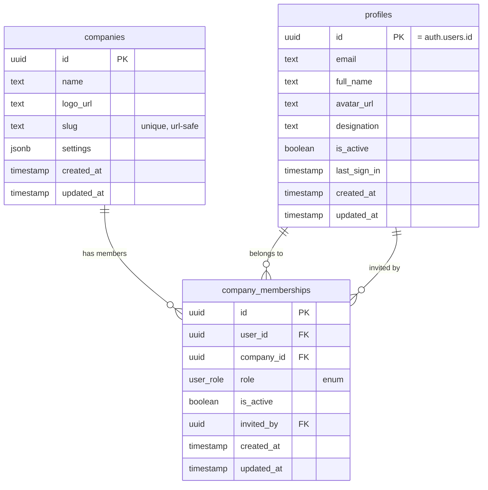

# Auth & RBAC System — Implementation Plan (Multi-Tenant Ready)

## Overview
This document serves as a persistent architectural reference and implementation blueprint for the high-fidelity role-based access control (RBAC) and multi-tenant-ready authentication system. It describes the design patterns, security controls, client-server boundary decoupling, database schemas, and management views.

### System Architecture
The authentication system is designed around a multi-tenant-ready structure spanning three custom database tables: `companies`, `profiles`, and `company_memberships`.
Role assignments are defined **per-company** in the memberships table. This supports advanced configurations (e.g. one user belonging to multiple companies with completely different role privileges).

## Schema Design



*   **Role hierarchy index**: `super_admin` > `company_admin` > `manager` > `inspector` > `viewer`
*   **Active Company Switcher**: Supported seamlessly. The active company's state is stored under the client's `localStorage` as `active_company_id` and cached on the client tree. It defaults automatically to the user's first membership, passing the company context in headers via the `x-company-id` header on API requests.

---

## Technical Separation of Concerns (Decoupling)

To prevent Next.js build errors (specifically due to Client Components importing server-side dependencies like `cookies` from `"next/headers"`), the role validation layer is split strictly into two modules:

### 1. Pure Base Layer (Client-Safe)
📄 `utils/role-auth-base.ts`
*   Houses pure TypeScript interfaces (`Profile`, `Company`, `CompanyMembership`).
*   Declares the global role hierarchy array (`ROLE_HIERARCHY`).
*   Provides `hasMinimumRole(userRole, requiredRole)` — a pure utility that does not perform database connections or import server headers.
*   **Zero external dependencies**: Extremely lightweight and safe for any client-side hook, view, or component bundle.

### 2. Server Authorization Layer (Server-Only)
📄 `utils/role-auth.ts`
*   Imports core constructs from `role-auth-base.ts` and re-exports them to preserve backward compatibility.
*   Implements the high-order wrapper `withRole(allowedRoles, handler)` to protect server-side API routes.
*   Extracts company context by looking up the incoming `x-company-id` header or falling back to the user's default company.
*   Accesses Supabase database clients (`@/utils/supabase/server`).

---

## Proposed Changes

### Database Layer (SQL Migrations)

#### `scripts/migrations/001_create_auth_tables.sql`
```sql
-- ============================================================
-- 1. ENUM TYPE
-- ============================================================
CREATE TYPE public.user_role AS ENUM (
  'super_admin',
  'company_admin',
  'manager',
  'inspector',
  'viewer'
);

-- ============================================================
-- 2. COMPANIES TABLE
-- ============================================================
CREATE TABLE public.companies (
  id          UUID PRIMARY KEY DEFAULT gen_random_uuid(),
  name        TEXT NOT NULL,
  slug        TEXT UNIQUE NOT NULL,
  logo_url    TEXT,
  settings    JSONB DEFAULT '{}'::jsonb,
  created_at  TIMESTAMPTZ NOT NULL DEFAULT now(),
  updated_at  TIMESTAMPTZ NOT NULL DEFAULT now()
);

ALTER TABLE public.companies ENABLE ROW LEVEL SECURITY;

-- Any authenticated user can read companies they belong to
CREATE POLICY "Members can view their companies"
  ON public.companies FOR SELECT
  USING (
    EXISTS (
      SELECT 1 FROM public.company_memberships cm
      WHERE cm.company_id = companies.id
      AND cm.user_id = auth.uid()
      AND cm.is_active = true
    )
  );

-- Super admins can manage companies
CREATE POLICY "Super admins can manage companies"
  ON public.companies FOR ALL
  USING (
    EXISTS (
      SELECT 1 FROM public.company_memberships cm
      WHERE cm.user_id = auth.uid()
      AND cm.role = 'super_admin'
      AND cm.is_active = true
    )
  );

-- ============================================================
-- 3. PROFILES TABLE (identity only — no role)
-- ============================================================
CREATE TABLE public.profiles (
  id          UUID PRIMARY KEY REFERENCES auth.users(id) ON DELETE CASCADE,
  email       TEXT NOT NULL,
  full_name   TEXT DEFAULT '',
  avatar_url  TEXT DEFAULT '',
  designation TEXT DEFAULT '',
  is_active   BOOLEAN NOT NULL DEFAULT true,
  last_sign_in TIMESTAMPTZ,
  created_at  TIMESTAMPTZ NOT NULL DEFAULT now(),
  updated_at  TIMESTAMPTZ NOT NULL DEFAULT now()
);

ALTER TABLE public.profiles ENABLE ROW LEVEL SECURITY;

-- Users can read their own profile
CREATE POLICY "Users can view own profile"
  ON public.profiles FOR SELECT
  USING (auth.uid() = id);

-- Admins can read all profiles (for user management panel)
CREATE POLICY "Admins can view all profiles"
  ON public.profiles FOR SELECT
  USING (
    EXISTS (
      SELECT 1 FROM public.company_memberships cm
      WHERE cm.user_id = auth.uid()
      AND cm.role IN ('super_admin', 'company_admin')
      AND cm.is_active = true
    )
  );

-- Users can update their own profile (name, avatar, designation)
CREATE POLICY "Users can update own profile"
  ON public.profiles FOR UPDATE
  USING (auth.uid() = id)
  WITH CHECK (auth.uid() = id);

-- ============================================================
-- 4. COMPANY MEMBERSHIPS TABLE (user ↔ company ↔ role)
-- ============================================================
CREATE TABLE public.company_memberships (
  id          UUID PRIMARY KEY DEFAULT gen_random_uuid(),
  user_id     UUID NOT NULL REFERENCES public.profiles(id) ON DELETE CASCADE,
  company_id  UUID NOT NULL REFERENCES public.companies(id) ON DELETE CASCADE,
  role        public.user_role NOT NULL DEFAULT 'viewer',
  is_active   BOOLEAN NOT NULL DEFAULT true,
  invited_by  UUID REFERENCES public.profiles(id),
  created_at  TIMESTAMPTZ NOT NULL DEFAULT now(),
  updated_at  TIMESTAMPTZ NOT NULL DEFAULT now(),
  UNIQUE(user_id, company_id)
);

ALTER TABLE public.company_memberships ENABLE ROW LEVEL SECURITY;

-- Users can see their own memberships
CREATE POLICY "Users can view own memberships"
  ON public.company_memberships FOR SELECT
  USING (user_id = auth.uid());

-- Admins can view all memberships in their company
CREATE POLICY "Admins can view company memberships"
  ON public.company_memberships FOR SELECT
  USING (
    EXISTS (
      SELECT 1 FROM public.company_memberships cm
      WHERE cm.user_id = auth.uid()
      AND cm.company_id = company_memberships.company_id
      AND cm.role IN ('super_admin', 'company_admin')
      AND cm.is_active = true
    )
  );

-- Admins can insert memberships (invite users to company)
CREATE POLICY "Admins can invite to company"
  ON public.company_memberships FOR INSERT
  WITH CHECK (
    EXISTS (
      SELECT 1 FROM public.company_memberships cm
      WHERE cm.user_id = auth.uid()
      AND cm.company_id = company_memberships.company_id
      AND cm.role IN ('super_admin', 'company_admin')
      AND cm.is_active = true
    )
  );

-- Admins can update memberships (change role, deactivate)
CREATE POLICY "Admins can update company memberships"
  ON public.company_memberships FOR UPDATE
  USING (
    EXISTS (
      SELECT 1 FROM public.company_memberships cm
      WHERE cm.user_id = auth.uid()
      AND cm.company_id = company_memberships.company_id
      AND cm.role IN ('super_admin', 'company_admin')
      AND cm.is_active = true
    )
  );

-- ============================================================
-- 5. INDEXES
-- ============================================================
CREATE INDEX idx_memberships_user ON public.company_memberships(user_id);
CREATE INDEX idx_memberships_company ON public.company_memberships(company_id);
CREATE INDEX idx_memberships_role ON public.company_memberships(role);
CREATE INDEX idx_profiles_email ON public.profiles(email);

-- ============================================================
-- 6. AUTO-CREATE PROFILE + DEFAULT MEMBERSHIP ON SIGN-UP
-- ============================================================
CREATE OR REPLACE FUNCTION public.handle_new_user()
RETURNS TRIGGER AS $$
DECLARE
  default_company_id UUID;
BEGIN
  -- Get the default company (first company, or create one)
  SELECT id INTO default_company_id
  FROM public.companies
  ORDER BY created_at ASC
  LIMIT 1;

  -- Create profile
  INSERT INTO public.profiles (id, email, full_name, avatar_url, designation)
  VALUES (
    NEW.id,
    NEW.email,
    COALESCE(NEW.raw_user_meta_data->>'full_name', ''),
    COALESCE(NEW.raw_user_meta_data->>'avatar_url', ''),
    COALESCE(NEW.raw_user_meta_data->>'designation', '')
  );

  -- Create membership to default company as viewer
  IF default_company_id IS NOT NULL THEN
    INSERT INTO public.company_memberships (user_id, company_id, role)
    VALUES (NEW.id, default_company_id, 'viewer');
  END IF;

  RETURN NEW;
END;
$$ LANGUAGE plpgsql SECURITY DEFINER;

CREATE TRIGGER on_auth_user_created
  AFTER INSERT ON auth.users
  FOR EACH ROW EXECUTE FUNCTION public.handle_new_user();

-- ============================================================
-- 7. UPDATED_AT TRIGGERS
-- ============================================================
CREATE OR REPLACE FUNCTION public.update_updated_at()
RETURNS TRIGGER AS $$
BEGIN
  NEW.updated_at = now();
  RETURN NEW;
END;
$$ LANGUAGE plpgsql;

CREATE TRIGGER companies_updated_at
  BEFORE UPDATE ON public.companies
  FOR EACH ROW EXECUTE FUNCTION public.update_updated_at();

CREATE TRIGGER profiles_updated_at
  BEFORE UPDATE ON public.profiles
  FOR EACH ROW EXECUTE FUNCTION public.update_updated_at();

CREATE TRIGGER memberships_updated_at
  BEFORE UPDATE ON public.company_memberships
  FOR EACH ROW EXECUTE FUNCTION public.update_updated_at();
```

#### `scripts/migrations/002_bootstrap_users.sql`
```sql
-- 1. Create default company
INSERT INTO public.companies (name, slug)
VALUES ('Offshore Data Management', 'offshore-data-mgmt')
ON CONFLICT (slug) DO NOTHING;

-- 2. Create profiles for all existing users
INSERT INTO public.profiles (id, email, full_name)
SELECT
  u.id,
  u.email,
  COALESCE(u.raw_user_meta_data->>'full_name', '')
FROM auth.users u
LEFT JOIN public.profiles p ON u.id = p.id
WHERE p.id IS NULL;

-- 3. Create memberships for all existing users (default: viewer)
INSERT INTO public.company_memberships (user_id, company_id, role)
SELECT
  p.id,
  c.id,
  'viewer'::public.user_role
FROM public.profiles p
CROSS JOIN (SELECT id FROM public.companies ORDER BY created_at LIMIT 1) c
LEFT JOIN public.company_memberships cm ON cm.user_id = p.id AND cm.company_id = c.id
WHERE cm.id IS NULL;

-- 4. Promote your account to super_admin
UPDATE public.company_memberships
SET role = 'super_admin'
WHERE user_id = (SELECT id FROM public.profiles WHERE email = 'jitesh@nasquest.com');
```

---

## Client Hooks & Providers

### `components/user-profile-provider.tsx`
Creates a context bridge from layout server fetches directly to client components.
*   Pre-fetches profile + company contexts server-side to prevent Layout Shift (CLS).
*   Integrates localStorage cache to persist context transitions seamlessly.

### `utils/hooks/use-user-role.ts`
Custom React hook returning user contexts and role shortcut queries:
```typescript
const {
  role,             // Current company role level ('viewer' | 'inspector' etc)
  profile,          // User profile record
  company,          // Active company context
  membership,       // Membership metadata
  companies,        // Array of all companies user belongs to
  activeCompanyId,  // Active company UUID
  setActiveCompany, // Trigger active context switch
  isLoading,
  isAdmin,          // shortcut: company_admin or super_admin
  canEdit,          // shortcut: inspector or higher
} = useUserRole();
```

### `components/role-gate.tsx`
Client UI conditional layout renderer:
```tsx
<RoleGate minRole="manager" fallback={<ReadOnlyMessage />}>
  <EditReportButton />
</RoleGate>
```

---

## Administration User Panel

### `app/dashboard/admin/users/page.tsx`
Highly responsive admin control board.
*   Interactive members list with TanStack data tables.
*   Full search controls (by Name, Email, Role).
*   Inline selector dropdown to dynamically update user role levels.
*   Soft-deactivate toggle switches preventing self-lockout.

### `app/dashboard/admin/users/invite-dialog.tsx`
Pop-up modal dialog prompt:
*   Submits Email, Full Name, Designation, and Target Role level directly.
*   Accesses custom invitation route triggers.

---

## Multi-Tenant Upgrade Path (Future Phases)
To add a secondary tenant/company to the live platform without breaking changes:
1.  Insert the company record under the `companies` table.
2.  Add user linkages via `company_memberships`.
3.  Add the `company_id` foreign key column incrementally on target operational tables (e.g. `platform`, `jobpack`):
    ```sql
    ALTER TABLE platform ADD COLUMN company_id UUID REFERENCES companies(id);
    UPDATE platform SET company_id = (SELECT id FROM companies LIMIT 1);
    ALTER TABLE platform ALTER COLUMN company_id SET NOT NULL;
    ```
4.  Configure row-level security (RLS) policies on operational tables:
    ```sql
    CREATE POLICY platform_tenant_isolation ON platform
      FOR ALL USING (company_id IN (
        SELECT company_id FROM company_memberships WHERE user_id = auth.uid() AND is_active = true
      ));
    ```
5.  All database layers and profile schemas remain unchanged!
