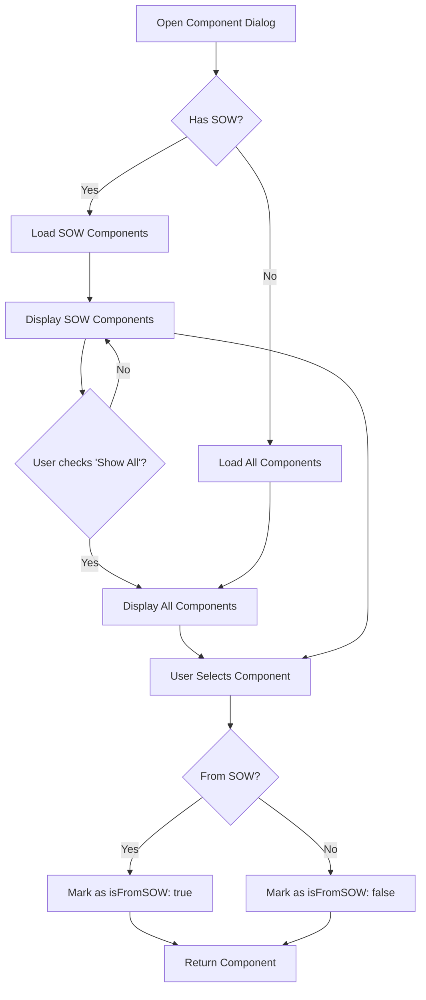

# 🎯 SOW-Based Component Search with Ad-hoc Support

## Overview
Enhanced the Component Selection Dialog to prioritize components from the Scope of Work (SOW) while allowing ad-hoc component selection for inspections not planned in the SOW.

---

## ✅ Phase 1 Completed: Enhanced Component Search

### **Features Implemented**

#### 1. **Priority Search from SOW (u_sow_items)**
- ✅ Automatically loads components from `u_sow_items` table
- ✅ Filters by `jobpack_id`, `structure_id`, and `sow_id`
- ✅ Shows inspection type and code from SOW
- ✅ Displays component ID, inspection name, and inspection code

#### 2. **Fallback to All Components**
- ✅ Checkbox to toggle "Show all components"
- ✅ Searches `structure_components` table when enabled
- ✅ Useful for ad-hoc inspections not in the SOW

#### 3. **Intelligent Filtering**
**For SOW Items:**
- Searches in `component_qid`
- Searches in `inspection_name`
- Searches in `inspection_code`

**For Structure Components:**
- Searches in `q_id`
- Searches in `metadata`
- Searches in `s_node` (start node)
- Searches in `f_node` (finish node)

#### 4. **Visual Indicators**
- 📋 Info banner showing "SOW Report (X items)"
- 🎯 Target icon for inspection names in SOW items
- Different display formats for SOW vs. structure components
- Component marked with `isFromSOW` flag when selected

---

## 📊 Database Queries

### **SOW Components Query:**
```sql
SELECT *,
       component_qid,
       inspection_code,
       inspection_name
FROM u_sow_items
WHERE sow_id = ?
  AND structure_id = ?
ORDER BY component_qid;
```

### **All Components Query (Fallback):**
```sql
SELECT *
FROM structure_components
WHERE str_id = ?
ORDER BY q_id;
```

---

## 🎨 UI/UX Enhancements

### **Component Display**

**SOW Items:**
```
┌─────────────────────────────────────┐
│ LEG-A1-001                          │
│ 🎯 Visual Inspection                │
│ Code: VI-001                        │
└─────────────────────────────────────┘
```

**Structure Components:**
```
┌─────────────────────────────────────┐
│ LEG-A1-001                          │
│ Metadata: Main Support Leg          │
│ Start: NODE-001                     │
│ End: NODE-002                       │
└─────────────────────────────────────┘
```

### **Info Banner**
- Shows when displaying SOW components
- Displays count of SOW items
- Hidden when showing all components

### **Checkbox Toggle**
- Only visible when SOW has components
- Label: "Show all components (for ad-hoc inspections not in SOW)"
- Allows switching between SOW and all components

---

## 🔄 Component Selection Flow



---

## 📝 Next Phase: Automatic SOW Updates

### **Still To Implement:**

#### 1. **Auto-add Ad-hoc Components to SOW**
When an inspection is saved with a component NOT from the SOW:
- Insert new row into `u_sow_items`
- Link to jobpack, structure, and SOW report
- Set inspection type/code from the inspection record

#### 2. **Update SOW Status Flags**
- Mark component as "Inspected" when inspection is completed
- Mark as "Incomplete" if task status is incomplete
- Track inspection progress per component

#### 3. **SOW Item Tracking Fields** (may need to add):
```sql
ALTER TABLE u_sow_items ADD COLUMN IF NOT EXISTS:
  - inspection_status VARCHAR(50)  -- 'PENDING', 'IN_PROGRESS', 'COMPLETED', 'INCOMPLETE'
  - inspected_at TIMESTAMP
  - inspection_record_id INTEGER  -- Reference to actual inspection
```

#### 4. **Update Trigger/Function**
Create database trigger or application logic to:
- Automatically update SOW when inspection is saved
- Handle both ROV and Diving inspections
- Update status based on inspection type

---

## 🔧 Modified Files

### **ComponentTreeDialog.tsx**
- Added `jobpackId` and `sowId` props
- Dual state for SOW and structure components
- Enhanced filtering for both data sources
- Conditional display logic
- Info banner and checkbox UI

### **rov/page.tsx**
- Passed `jobpackId` and `sowId` to ComponentTreeDialog

### **dive/page.tsx**
- Passed `jobpackId` and `sowId` to ComponentTreeDialog

---

## ✨ Benefits

1. **Workflow Efficiency**: Inspectors see only relevant components from the SOW first
2. **Flexibility**: Can still select any component for ad-hoc inspections
3. **Data Integrity**: Components tracked with clear SOW/ad-hoc distinction
4. **Progress Tracking**: Foundation for SOW completion status
5. **Audit Trail**: Know which inspections were planned vs. ad-hoc

---

## 🚀 Testing Checklist

- [ ] SOW components load correctly based on jobpack/structure/sow
- [ ] Search works for SOW items (qid, inspection name, code)
- [ ] Checkbox toggles between SOW and all components
- [ ] Structure components load when checkbox is enabled
- [ ] Search works for structure components (q_id, metadata, nodes)
- [ ] Selected component includes `isFromSOW` flag
- [ ] Info banner shows correct count
- [ ] Works for both ROV and Diving inspections

---

## 📌 Notes

The module now provides a **smart component selection** system that:
1. Prioritizes planned work from the SOW
2. Allows flexibility for unplanned inspections
3. Sets the foundation for automatic SOW status updates (Phase 2)

**Phase 2** (Automatic SOW Updates) will require database schema updates and trigger/function creation to maintain SOW status based on inspection records.
