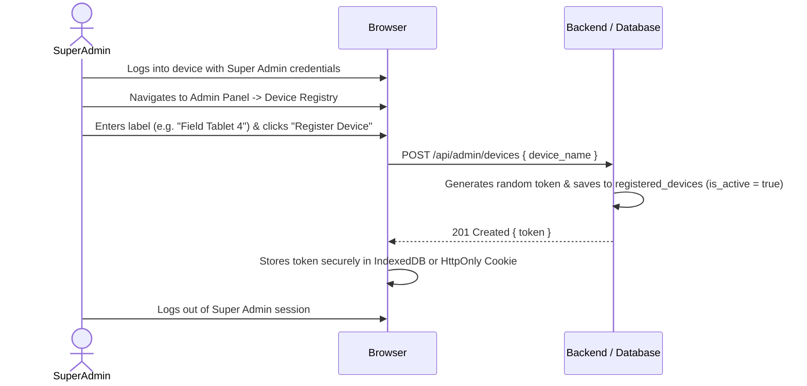
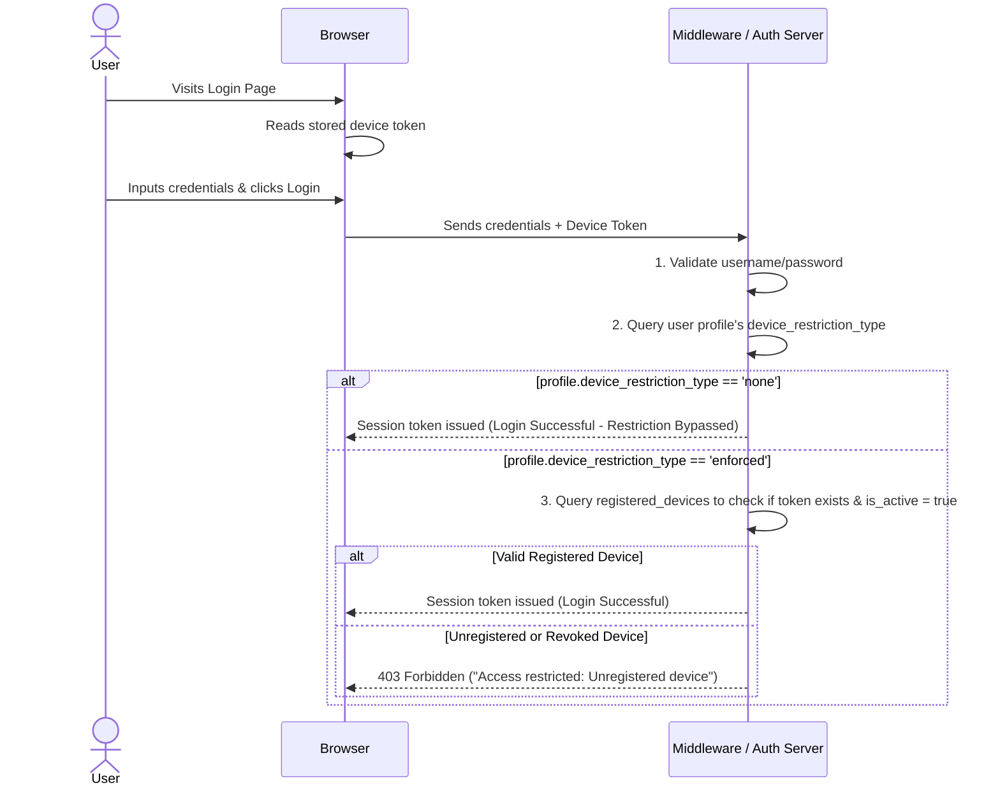

# Cryptographic Device Registration System (Multi-User, Shared Device Setup)

This document outlines the architectural plan and design specifications for restricting application access to approved, registered hardware devices.

---

## 1. System Rules & Constraints

1.  **Authorization Restriction**: Users with the role of **`super_admin`** or **`company_admin`** are permitted to register, view, or revoke devices in the registry.
2.  **Device-Centric (Multi-User) Model**: A device is registered to the company rather than bound to a single user. Once a device token is enrolled on a browser, any active, authorized user in that company can log in from that device.
3.  **User-Level Restriction Toggles**:
    *   **Unrestricted Users**: Certain user profiles can access the application from **any device** (no restriction checks).
    *   **Restricted Users**: Other users must access the application **only from registered, active devices**.
4.  **Bypass/Revocation**: Admins can immediately block a lost or discarded device by marking it as inactive or deleting it from the database registry.

---

## 2. Database Schema Design

A new relational table `registered_devices` is added, along with a configuration column on `profiles` to support user-level restriction toggles:

```sql
-- Add device restriction setting to profiles
ALTER TABLE public.profiles
ADD COLUMN IF NOT EXISTS device_restriction_type VARCHAR(20) NOT NULL DEFAULT 'none'; -- 'none' or 'enforced'

-- Create registered_devices table
CREATE TABLE public.registered_devices (
  id              UUID PRIMARY KEY DEFAULT gen_random_uuid(),
  company_id      UUID NOT NULL REFERENCES public.companies(id) ON DELETE CASCADE,
  device_name     VARCHAR(100) NOT NULL, -- e.g., "Field Tablet #4"
  device_token    VARCHAR(255) NOT NULL UNIQUE, -- Cryptographically secure token
  is_active       BOOLEAN NOT NULL DEFAULT true,
  registered_by   UUID NOT NULL REFERENCES public.profiles(id),
  created_at      TIMESTAMPTZ NOT NULL DEFAULT now(),
  updated_at      TIMESTAMPTZ NOT NULL DEFAULT now()
);

-- Enable Row Level Security (RLS)
ALTER TABLE public.registered_devices ENABLE ROW LEVEL SECURITY;

-- Allow super_admins and company_admins to manage devices
CREATE POLICY "Admins can manage devices"
  ON public.registered_devices FOR ALL
  USING (
    EXISTS (
      SELECT 1 FROM public.company_memberships cm
      WHERE cm.user_id = auth.uid()
      AND cm.role IN ('super_admin', 'company_admin')
      AND cm.is_active = true
    )
  );
```

---

## 3. Workflows

### Phase 1: Device Enrollment
When a new device (tablet, laptop, etc.) is provisioned:



### Phase 2: Login Validation (Multi-User Support)
When any user attempts to log in from a physical device:



---

## 4. API Endpoints

### 1. Register a Device
*   **Endpoint**: `POST /api/admin/devices`
*   **Protection**: `withRole(["super_admin"])`
*   **Body**:
    ```json
    {
      "device_name": "Field Tablet #3"
    }
    ```
*   **Logic**:
    1.  Validate active company ID.
    2.  Generate a cryptographically secure token (`crypto.randomBytes(32).toString('hex')`).
    3.  Insert `company_id`, `device_name`, `device_token`, and `registered_by` (current user ID).
    4.  Return the generated token.

### 2. Revoke a Device
*   **Endpoint**: `DELETE /api/admin/devices/[id]`
*   **Protection**: `withRole(["super_admin"])`
*   **Logic**:
    1.  Verify the device belongs to the admin's active company.
    2.  Update `is_active = false` or delete the row.

---

## 5. Security Recommendations

*   **Cookie Attributes**: Store the token in a cookie with `HttpOnly`, `Secure`, `SameSite=Strict` attributes to prevent XSS-based theft.
*   **Audit Logging**: Log registration and revocation events with timestamps and the identity of the super admin performing the operation.
