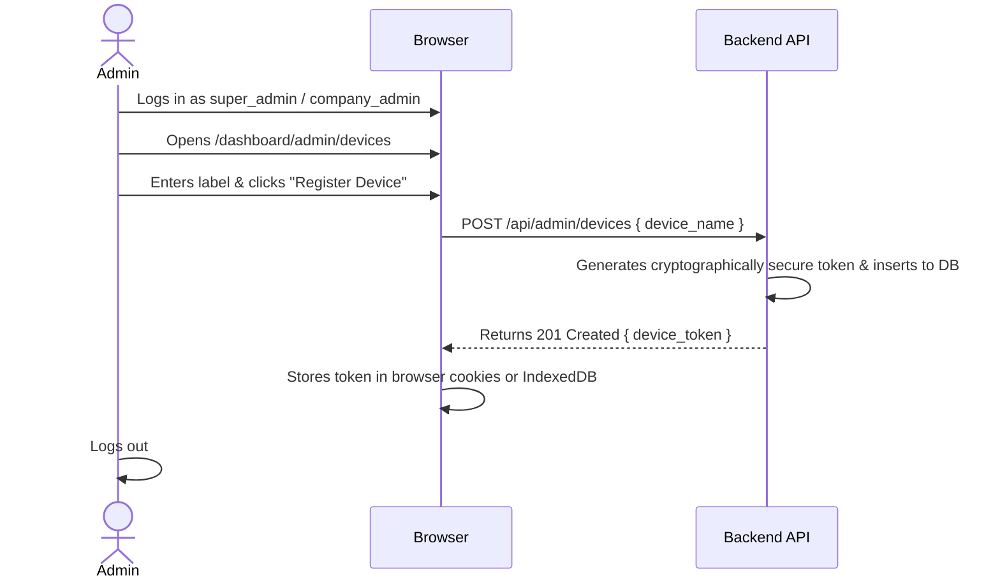
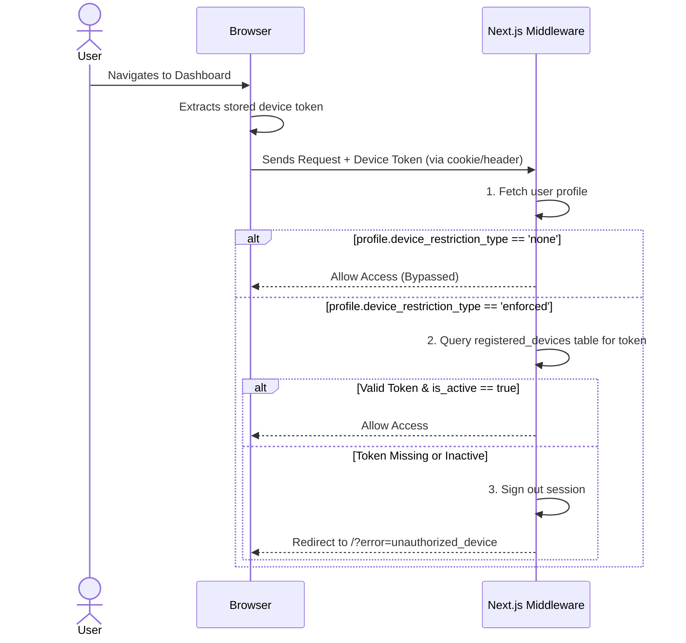

# Memory — Cryptographic Device Registration System

This file serves as a permanent memory reference for the **Device Registration** security feature implemented in this application.

---

## 1. Core Objectives & Constraints

*   **Goal**: Restrict application access to only approved and registered devices for specific users.
*   **Role Permissions**: Users with roles of **`super_admin`** or **`company_admin`** are allowed to manage (register, view, and revoke) devices.
*   **Multi-User Shared Devices**: Devices are registered at the organization level (mapped to a company). Once registered, any approved user within that company can log in using their credentials on that device.
*   **Granular User Enforcements**:
    *   **`device_restriction_type = 'none'`**: User bypasses the device check (can log in from any hardware).
    *   **`device_restriction_type = 'enforced'`**: User is strictly validated against the registered device registry (must use an approved device).

---

## 2. Relational Schema (`registered_devices`)

The registry is maintained in a dedicated PostgreSQL table:

```sql
CREATE TABLE public.registered_devices (
  id              UUID PRIMARY KEY DEFAULT gen_random_uuid(),
  company_id      UUID NOT NULL REFERENCES public.companies(id) ON DELETE CASCADE,
  device_name     VARCHAR(100) NOT NULL,
  device_token    VARCHAR(255) NOT NULL UNIQUE,
  is_active       BOOLEAN NOT NULL DEFAULT true,
  registered_by   UUID NOT NULL REFERENCES public.profiles(id),
  created_at      TIMESTAMPTZ NOT NULL DEFAULT now(),
  updated_at      TIMESTAMPTZ NOT NULL DEFAULT now()
);

-- RLS Policies
ALTER TABLE public.registered_devices ENABLE ROW LEVEL SECURITY;

CREATE POLICY "Admins can manage devices"
  ON public.registered_devices FOR ALL
  USING (
    EXISTS (
      SELECT 1 FROM public.company_memberships cm
      WHERE cm.user_id = auth.uid()
      AND cm.role IN ('super_admin', 'company_admin')
      AND cm.is_active = true
    )
  );
```

---

## 3. Workflow Diagrams

### A. Enrollment Flow


### B. Validation Flow (During Login/Session Check)


---

## 4. API Definition

*   `GET /api/admin/devices`: Returns a list of all enrolled devices for the active company.
*   `POST /api/admin/devices`: Registers a new device. Returns the generated secret token.
*   `PATCH /api/admin/devices/[id]`: Toggles `is_active` status.
*   `DELETE /api/admin/devices/[id]`: Revokes and deletes a device registration.

---

## 5. Multi-Tenant User Creation & Login-Time Tenant Selection Blueprint

### A. Direct User Provisioning (Without Email/SMTP)
*   **Creation Flow**: Admins / Super Admins can directly create a user account by specifying:
    *   `email`, `full_name`, `designation`, and a `default_password` (or auto-generated temporary password).
    *   Multi-tenant assignment matrix: select one or more companies and pick the specific role (`super_admin`, `company_admin`, `manager`, `inspector`, `viewer`) for each company.
*   **Backend Execution**: Backend calls `supabaseAdmin.auth.admin.createUser({ email, password, email_confirm: true })`, upserts `profiles`, and inserts rows into `company_memberships` for each assigned company.
*   **Password Management**: Credentials can be copied directly by the admin to share with the user; the user can update their password at any time via user profile settings.

### B. Login & Tenant Selection Workflow
1.  **Credential Authentication**: User submits Email + Password at `/sign-in`.
2.  **Membership Resolution**: System inspects all active `company_memberships` for the authenticated `user_id`:
    *   **Single Tenant (1 Company)**: Automatically set `active_company_id` cookie and redirect directly to `/dashboard`.
    *   **Multi-Tenant (>1 Companies)**: Redirect to `/select-tenant` workspace selection screen displaying each company with its branding and the user's role in that specific tenant.
    *   **Selection Action**: Upon selecting a workspace, `active_company_id` is persisted (cookie + client state), and user enters `/dashboard`.
3.  **Cross-Tenant Scoping**: All downstream API routes, CRUD operations, and Row-Level Security (RLS) policies enforce scoping using the active `company_id`.

